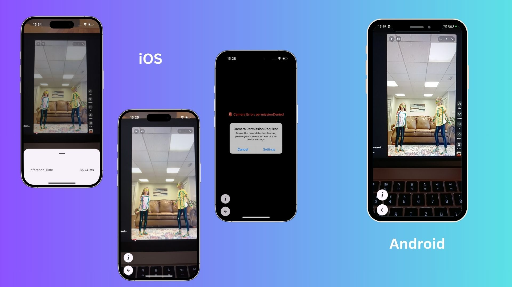

# PoseDetector

[](https://swift.org)
[](https://developer.apple.com/ios/)
[](LICENSE)

A minimal Kotlin Multiplatform app for Android and iOS that adapts the
[MediaPipe Pose Landmarker iOS sample](https://github.com/google-ai-edge/mediapipe-samples/tree/main/examples/pose_landmarker/ios)
to modern SwiftUI and iOS 17 and integrates with
[MediaPipe Pose Landmarker Android sample](https://github.com/google-ai-edge/mediapipe-samples/tree/main/examples/pose_landmarker/android)
into a KMP app using Decompose ready to extend with other features.

## Features

- 📸 **Shared App Frame**: using Decompose and integrating the platform dependent pose detection screen.
- 📸 **Real-Time Pose Detection**: Processes video frames using MediaPipe's Pose Landmarker.

### On iOS

- 🖼️ **SwiftUI Integration**: Displays camera preview and pose overlays with `UIViewRepresentable`.
- 🚀 **Modern Concurrency**: Uses Combine for reactive state updates.

## Screenshots



## Requirements

- **Android**: 7+
- **iOS**: 17.6+
- **Xcode**: 16.0+
- **Dependencies**:
    - Decompose
    - MediaPipe Pose Landmarker (via Pods on iOS)
    - AVFoundation (native)
    - Combine (native)

## Installation

1. Clone the repository:
   ```bash
   git clone https://github.com/PopradiArpad/PoseDetector.git

2. For iOS install the pods.
   
